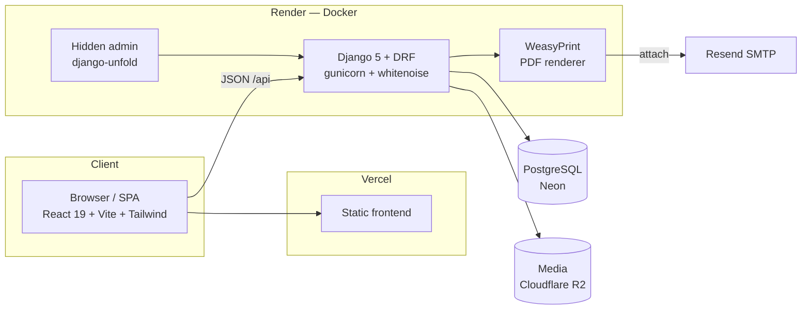

# Treasure Pharmacy — Digital Clinic & Pharmacy Portal

A full-stack digital clinic platform for a Kampala pharmacy: clients book lab tests,
consultations, home care and bedside nursing online; every booking is auto-compiled into a
branded **PDF intake form** and emailed to the pharmacy, while the client gets a reference
number and confirmation email. Staff manage bookings, stock, pricing and site content from a
**hidden back-office** that is never linked from the public site.

> Portfolio rebuild of a real client engagement. The brief, feature set and constraints come
> from an actual project plan prepared for a Kampala pharmacy chain.

**Stack:** Django 5 · DRF · PostgreSQL · React 19 · TypeScript · Vite · Tailwind CSS 4 ·
TanStack Query · WeasyPrint · Docker

---

## Features

| Area | What it does |
| --- | --- |
| **Public site** | Home, services catalogue with UGX pricing, branch locator with embedded Google Maps, about/contact — fully responsive, zero dead links |
| **Booking system** | Validated multi-field form (react-hook-form + zod), preselects a service from any "Book now" button, supports branch visits *and* home visits |
| **PDF pipeline** | Each booking renders a styled A4 intake form (WeasyPrint) attached to the notification email — bookings survive PDF/email outages by design |
| **Email pipeline** | Pharmacy inbox gets the PDF; the client gets a confirmation with their reference (`TRP-XXXXXX`, no confusable characters) |
| **Hidden back-office** | Django Admin at an env-configured secret path, themed with django-unfold: booking queue with status workflow actions, stock & price management with inline editing, admin-editable site copy (content blocks) |
| **WhatsApp** | Floating click-to-chat button + footer/contact links; number is admin-editable content |
| **API** | Documented REST API — Swagger UI at `/api/docs/`, schema via drf-spectacular; public booking endpoint is rate-throttled |

## Architecture



**Booking flow:** `POST /api/bookings/` → validate (service active, date not past, throttle)
→ persist with unique reference → render PDF from an HTML template → email PDF to the
pharmacy inbox + confirmation to the client → `201` with the reference. PDF/email failures
are logged but never lose the booking.

## Quick start (local)

Requirements: Docker, Python 3.12+ with [uv](https://docs.astral.sh/uv/), Node 20+.

```bash
# 1. Database
docker compose up -d

# 2. Backend — http://localhost:8000
cd backend
uv sync
cp .env.example .env
uv run python manage.py migrate
uv run python manage.py seed_demo          # branches, services, products, site copy
uv run python manage.py createsuperuser
uv run python manage.py runserver

# 3. Frontend — http://localhost:5173
cd frontend
npm install
npm run dev
```

- API docs: <http://localhost:8000/api/docs/>
- Back office: <http://localhost:8000/back-office/> (path is `ADMIN_URL` in `.env`)
- Emails print to the runserver console in development.

## Tests & linting

```bash
cd backend && uv run pytest && uv run ruff check .   # pipeline, API, throttle, seed tests
cd frontend && npm run lint && npm run build          # oxlint + tsc + vite
```

CI (GitHub Actions) runs both suites on every push/PR, with a real PostgreSQL service and
the WeasyPrint system libraries installed.

## Deployment (free tier)

| Piece | Where | Notes |
| --- | --- | --- |
| Frontend | **Vercel** | Root dir `frontend/`, SPA rewrites via `vercel.json`, set `VITE_API_URL` |
| API | **Render** (Docker) | Blueprint in `render.yaml`; the Dockerfile bakes in WeasyPrint's Pango/HarfBuzz deps, runs migrations on boot |
| Database | **Neon** | Free Postgres; paste the connection string into `DATABASE_URL` |
| Media | **Cloudflare R2** | S3-compatible via django-storages; enable with `USE_R2=True` |
| Email | **Resend** | SMTP bridge, free tier; `EMAIL_HOST_PASSWORD` is the API key |

Set `ADMIN_URL` to an unguessable path in production — the back office is deliberately not
linked anywhere on the frontend.

<details>
<summary><strong>Original AWS architecture (from the client engagement)</strong></summary>

The original project plan targeted AWS: React build on **S3 + CloudFront**, Django on
**EC2** behind an ALB, **RDS PostgreSQL**, media on **S3**, and booking emails through
**SES**. This rebuild swaps each piece for a free-tier equivalent so the demo can stay live
indefinitely, while keeping the same separation (static frontend / containerised API /
managed Postgres / object storage / transactional email) — the AWS layout maps 1:1 back
onto it if a client wants to run it there.

</details>

## Project layout

```text
pharmacy/
├── backend/
│   ├── config/               # settings split: base / dev / prod / test
│   ├── apps/
│   │   ├── catalog/          # Branch, ServiceCategory, Service, Product (+ seed_demo)
│   │   ├── bookings/         # Booking model, API, PDF + email pipeline
│   │   └── content/          # admin-editable content blocks
│   ├── templates/            # PDF intake form + email bodies
│   ├── tests/                # pytest suite
│   └── Dockerfile
├── frontend/
│   └── src/
│       ├── api/              # typed client + TanStack Query hooks
│       ├── components/       # layout, navbar, footer, WhatsApp button, cards, icons
│       └── pages/            # Home, Services, ServiceDetail, Booking, Branches, …
├── docker-compose.yml        # local PostgreSQL
├── render.yaml               # API deploy blueprint
└── .github/workflows/ci.yml
```

## Roadmap

- **Payments (next):** Flutterwave sandbox — inline checkout with test cards and simulated
  MTN/Airtel Mobile Money, webhook-driven `payment_status` updates (fields already on the
  Booking model), emailed receipts.
- Client accounts with booking history; 2FA (django-otp) for the back office; task queue
  for the PDF/email pipeline.
