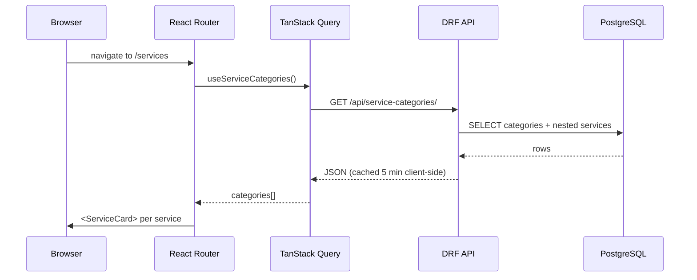
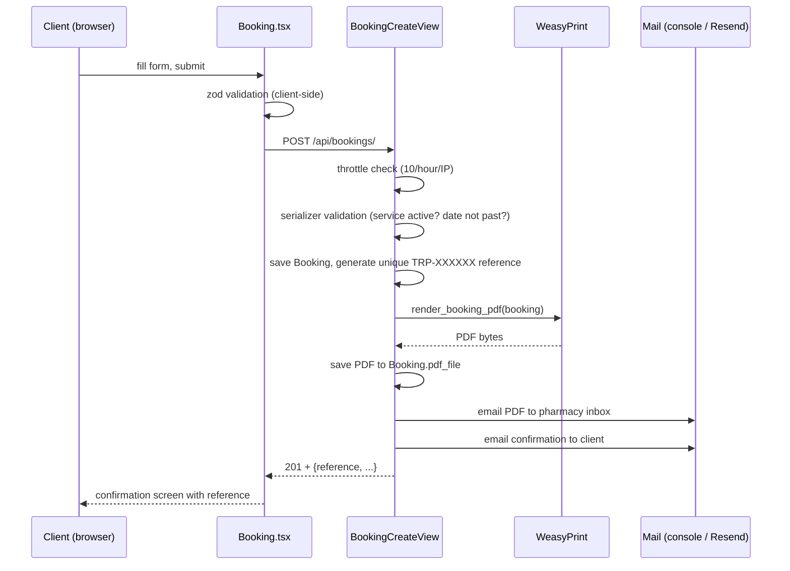

# How the site works

This is a walkthrough of how content gets created, how it's rendered, and what happens
when someone books a service. It's written to be read alongside the code — every
section names the actual files involved.

## 1. Where content comes from

Nothing on the public site is hard-coded copy sitting in React components. Everything a
visitor sees is either **structured data** (services, branches, products) or **admin-editable
text** (headings, blurbs), both served by the same Django API.

| What | Model | Table-ish shape | Edited via |
| --- | --- | --- | --- |
| Branches | `Branch` ([apps/catalog/models.py](../backend/apps/catalog/models.py)) | name, address, phone, Google Maps embed URL | Back office |
| Service categories | `ServiceCategory` | Lab Tests / Consultations / Home Care / Bedside Nursing | Back office |
| Services | `Service` | name, price (UGX), description, category FK | Back office |
| Products | `Product` | pharmacy stock items, price, quantity | Back office |
| Free-text copy | `ContentBlock` ([apps/content/models.py](../backend/apps/content/models.py)) | a `key` (e.g. `home-hero-heading`) → `text` / `image` | Back office |

`ContentBlock` is the lightweight CMS piece: instead of the homepage headline being
frozen in `Home.tsx`, it's a row with `key="home-hero-heading"`. The frontend looks the
key up at render time and falls back to a hard-coded default if the block is empty —
see [`useContent()`](../frontend/src/api/hooks.ts) and its use in
[`Home.tsx`](../frontend/src/pages/Home.tsx).

**On first boot**, [`seed_demo`](../backend/apps/catalog/management/commands/seed_demo.py)
populates all of this with realistic demo data (3 Kampala branches, 14 services across 4
categories, 10 pharmacy products, 5 content blocks). It's idempotent — safe to re-run — so
`docker compose up` calls it every time the backend container starts without ever
duplicating rows.

**After boot**, everything is edited by hand through the hidden back office at
`/back-office/` (Django Admin themed with django-unfold — see
[apps/catalog/admin.py](../backend/apps/catalog/admin.py),
[apps/content/admin.py](../backend/apps/content/admin.py)). Stock quantities and prices
are `list_editable`, so they update inline from the list view without opening a record.

## 2. How content becomes a rendered page

Every page follows the same shape:

1. A page component (e.g. [`Services.tsx`](../frontend/src/pages/Services.tsx)) calls a
   typed hook from [`api/hooks.ts`](../frontend/src/api/hooks.ts) —
   `useServiceCategories()`, `useBranches()`, `useService(slug)`, `useContent()`.
2. Each hook wraps a plain `fetch` ([`api/client.ts`](../frontend/src/api/client.ts))
   in a TanStack Query `useQuery`, which handles caching (5 min stale time, set in
   [`main.tsx`](../frontend/src/main.tsx)), retries, and loading/error states.
3. On the Django side, the request hits a DRF `ListAPIView` or `ReadOnlyModelViewSet`
   ([apps/catalog/views.py](../backend/apps/catalog/views.py)), which filters to
   `is_active=True` records and serializes them
   ([apps/catalog/serializers.py](../backend/apps/catalog/serializers.py)).
4. The component renders the response with Tailwind utility classes — there's no
   separate design system, styling is inline in JSX.

The whole frontend is a single-page app (Vite + React Router). Routes live in
[`App.tsx`](../frontend/src/App.tsx); [`Layout.tsx`](../frontend/src/components/Layout.tsx)
wraps every route in the navbar, footer and floating WhatsApp button so those three
things fetch their data (branches, the WhatsApp number content block) exactly once per
navigation, not once per page.

## 3. The booking flow — content creation from the *client* side

This is the one place a site visitor writes data rather than just reading it, and it
chains four separate side effects off a single form submission.

Step by step, with the actual files:

1. **Client-side validation** — [`Booking.tsx`](../frontend/src/pages/Booking.tsx) uses
   `react-hook-form` + a `zod` schema to catch bad input (invalid email/phone, missing
   home address for home visits) before anything hits the network.
2. **API validation** — [`BookingCreateSerializer`](../backend/apps/bookings/serializers.py)
   re-validates independently of the frontend: the chosen service must still be active,
   the branch must still be active, and the preferred date can't be in the past.
3. **Throttling** — [`BookingCreateView`](../backend/apps/bookings/views.py) applies a
   `ScopedRateThrottle` (10 requests/hour/IP, configured in
   [config/settings/base.py](../backend/config/settings/base.py)) to stop the public
   form being spammed.
4. **Reference generation** — [`Booking.save()`](../backend/apps/bookings/models.py)
   generates a `TRP-XXXXXX` code from an alphabet with no `0/O/1/I/L`, because it's
   meant to be read aloud over a phone call without ambiguity.
5. **PDF rendering** — [`process_booking()`](../backend/apps/bookings/services.py) calls
   WeasyPrint to render [`templates/pdf/booking.html`](../backend/templates/pdf/booking.html)
   (an HTML+CSS intake form) to PDF bytes, then saves it onto the booking record.
6. **Email pipeline** — two emails go out from templates in
   [`templates/email/`](../backend/templates/email/): the pharmacy inbox gets the PDF
   attached, the client gets a plain-text confirmation with their reference.
7. **Resilience** — PDF generation and each email send are wrapped in their own
   try/except that logs and swallows the error. A WeasyPrint crash or an SMTP outage
   never rolls back or loses the booking — it just means that one side effect didn't
   happen, and it's visible as a booking with no PDF in the back office.
8. **Confirmation** — the frontend replaces the form with a reference-number screen
   ([`Booking.tsx`](../frontend/src/pages/Booking.tsx)) instead of redirecting, so a
   page refresh doesn't lose the confirmation.

## 4. Other actions in the webapp

- **Booking status workflow** — in the back office, staff select bookings and run bulk
  admin actions (`mark_confirmed`, `mark_completed`, `mark_cancelled`, see
  [apps/bookings/admin.py](../backend/apps/bookings/admin.py)) to move a booking through
  `pending → confirmed → completed`, or `cancelled`.
- **Stock and pricing edits** — `Product` and `Service` admin list views have
  `list_editable` price/stock fields, so a price change is a single inline edit and
  save, not a full form.
- **WhatsApp click-to-chat** — the floating button
  ([`WhatsAppButton.tsx`](../frontend/src/components/WhatsAppButton.tsx)) and footer
  link build a `wa.me` URL from the `whatsapp-number` content block plus a pre-filled
  message — no WhatsApp Business API integration, just a deep link.
- **Branch maps** — each `Branch.maps_embed_url` is dropped straight into an `<iframe>`
  on the [Branches page](../frontend/src/pages/Branches.tsx); there's no Maps API key
  or JS SDK involved.
- **API docs** — every endpoint is introspected automatically by drf-spectacular and
  served as Swagger UI at `/api/docs/` ([config/urls.py](../backend/config/urls.py)) —
  nothing is hand-written.
- **Hidden admin** — the back office is mounted at whatever path `ADMIN_URL` is set to
  (`.env`), and it is the *only* URL that resolves to it — `/admin/` itself 404s. No
  link to it exists anywhere in the public React app.

## 5. The one-command dev loop

`docker compose up --build` starts three containers (db, backend, frontend). The backend
container's boot command ([docker-compose.yml](../docker-compose.yml)) runs
`migrate` → `seed_demo` → `createsuperuser` (skipped if one exists) → `runserver`, so a
completely fresh checkout reaches a fully seeded, login-ready app with one command. Both
app containers bind-mount the source tree, so edits to Python or TypeScript hot-reload
without a rebuild.
