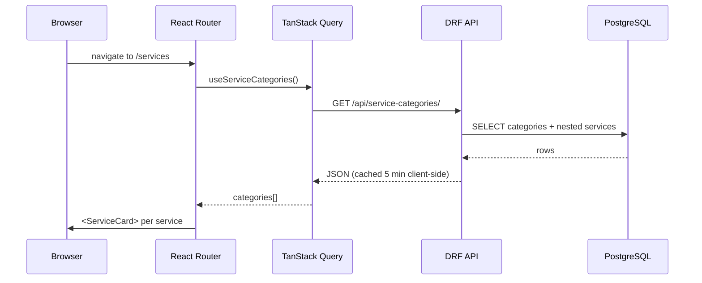
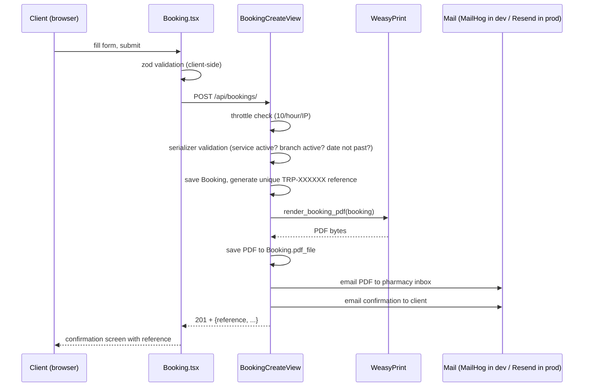

# How the site works

This is a walkthrough of how the project is put together: who uses it, which screens it
can show, where content comes from, how it's rendered, and what happens when someone
books a service. It's written to be read alongside the code, and every section names the
files involved.

For step-by-step instructions aimed at people *using* the site and back office, see
[USER_GUIDE.md](USER_GUIDE.md).

## 1. The big picture

The project has three surfaces, all backed by one Django API and one PostgreSQL database:

| Surface | Who sees it | Built with | Where |
| --- | --- | --- | --- |
| **Public site** | Anyone (clients, no login) | React 19 SPA ([frontend/src](../frontend/src)) | `http://localhost:5173` / Vercel |
| **Back office** | Staff and admins (login) | Django Admin + django-unfold | `/back-office/` on the API (path set by `ADMIN_URL`) |
| **Generated documents** | Pharmacy inbox + the client | Django templates + WeasyPrint | PDF intake form and two emails per booking |

There are also two developer-facing pages: Swagger UI at `/api/docs/` and, in local dev,
the MailHog inbox at `http://localhost:8025`.

### User types

| Type | Account? | What they can do |
| --- | --- | --- |
| **Visitor / client** | None. There is no sign-up or login on the public site | Browse services, prices and branches; submit a booking; contact the pharmacy on WhatsApp, phone or email |
| **Staff user** | Django user with *Staff status* and specific permissions | Only what their permissions allow, typically working the booking queue and updating stock and prices |
| **Administrator** | Django superuser | Everything in the back office, including user accounts and creating or deleting content blocks |
| **Pharmacy inbox** | An email address (`PHARMACY_INBOX_EMAIL`) | Receives every new booking with the PDF attached |

Roles come from Django's built-in auth (users, groups, per-model permissions). The app
defines no custom roles. The only role-specific code is in
[apps/content/admin.py](../backend/apps/content/admin.py): only superusers can add or
delete content blocks.

## 2. Where content comes from

Almost nothing a visitor sees about services, prices or branches is written into the
React components. It is either **structured data** (services, branches, products) or
**admin-editable text** (headings, blurbs), and the same Django API serves both.

| What | Model | Shape | Edited via |
| --- | --- | --- | --- |
| Branches | `Branch` ([apps/catalog/models.py](../backend/apps/catalog/models.py)) | name, address, phone, Google Maps embed URL, active flag, ordering | Back office |
| Service categories | `ServiceCategory` | Lab Tests / Consultations / Home Care / Bedside Nursing, blurb, ordering | Back office |
| Services | `Service` | name, slug, price (UGX), short + long description, category, active flag | Back office |
| Products | `Product` | pharmacy stock items, category, price, stock quantity, active flag | Back office |
| Free-text copy | `ContentBlock` ([apps/content/models.py](../backend/apps/content/models.py)) | a `key` (e.g. `home-hero-heading`) → `text` / `image` | Back office |
| Bookings | `Booking` ([apps/bookings/models.py](../backend/apps/bookings/models.py)) | client details, service, branch or home address, date/time, status | Created by clients; managed in back office |

`ContentBlock` is a lightweight CMS. Instead of the homepage headline being frozen in
`Home.tsx`, it's stored as a row with `key="home-hero-heading"`. The frontend looks the
key up at render time and falls back to a hard-coded default if the block is missing.
See [`useContent()`](../frontend/src/api/hooks.ts) and its use in
[`Home.tsx`](../frontend/src/pages/Home.tsx). The seeded keys are:

| Key | Used on | Effect |
| --- | --- | --- |
| `home-hero-heading` | Home | Big hero headline |
| `home-hero-subheading` | Home | Paragraph under the headline |
| `home-announcement` | Home | Dark strip above the hero; hidden when empty |
| `about-intro` | About | Intro paragraph |
| `whatsapp-number` | Every page (floating button), Home, Footer, Contact | Number used to build `wa.me` links (digits only, e.g. `256700123000`) |

Some copy is still hard-coded in the components: the footer and Contact page phone
number and email, the "3 branches in Kampala" checklist on Home, the About page's three
value cards, and the "What to expect" list on service pages.

**Demo data.** [`seed_demo`](../backend/apps/catalog/management/commands/seed_demo.py)
fills the database with realistic data: 3 Kampala branches, 14 services in 4 categories,
10 pharmacy products and 5 content blocks. It can safely be re-run:
branches, categories, services and products are `update_or_create`d by name or slug, and
content blocks are only created if missing (or refilled if their text is empty). An
edited content block is left alone. Running the seed resets seeded services, products and
branches back to their seeded prices and stock. Locally, `docker compose up` runs it every
time the backend container starts (see §8).

**After boot**, staff edit everything through the back office at `/back-office/`
(Django Admin themed with django-unfold; see
[apps/catalog/admin.py](../backend/apps/catalog/admin.py),
[apps/content/admin.py](../backend/apps/content/admin.py),
[apps/bookings/admin.py](../backend/apps/bookings/admin.py)).

## 3. How content becomes a rendered page

Every page follows the same shape:

1. A page component (e.g. [`Services.tsx`](../frontend/src/pages/Services.tsx)) calls a
   typed hook from [`api/hooks.ts`](../frontend/src/api/hooks.ts):
   `useServiceCategories()`, `useBranches()`, `useService(slug)`, `useContent()`.
2. Each hook wraps a plain `fetch` ([`api/client.ts`](../frontend/src/api/client.ts))
   in a TanStack Query `useQuery`. The hook handles caching (5 min stale time, 1 retry, set in
   [`main.tsx`](../frontend/src/main.tsx)) and loading/error states.
3. On the Django side, the request hits a DRF `ListAPIView` or `ReadOnlyModelViewSet`
   ([apps/catalog/views.py](../backend/apps/catalog/views.py)). The view filters to
   `is_active=True` records and serializes them
   ([apps/catalog/serializers.py](../backend/apps/catalog/serializers.py)).
4. The component renders the response with Tailwind utility classes. There's no separate
   design system; styling is inline in JSX.

The frontend is a single-page app (Vite + React Router). Routes live in
[`App.tsx`](../frontend/src/App.tsx). [`Layout.tsx`](../frontend/src/components/Layout.tsx)
wraps every route in the navbar, footer and floating WhatsApp button, and scrolls to the
top on each navigation. Several components ask for the same data (the footer, Home and
Contact all use branches and content). TanStack Query de-duplicates those calls by query
key, so each endpoint is fetched once and then served from cache for five minutes.
The practical consequence: **a change made in the back office can take up to five minutes
to show for a visitor who already has the site open**. A full page reload shows it
immediately.

## 4. Screens

### 4.1 Public site

Every public screen shares the same frame:

- **Navbar** ([Navbar.tsx](../frontend/src/components/Navbar.tsx)): logo, links to
  Home / Services / Branches / About / Contact, and a teal **Book now** button. Below the
  `md` breakpoint the links collapse into a hamburger menu.
- **Footer** ([Footer.tsx](../frontend/src/components/Footer.tsx)): short blurb, "Explore"
  links, the live list of branches, and WhatsApp / phone / email contacts.
- **Floating WhatsApp button**
  ([WhatsAppButton.tsx](../frontend/src/components/WhatsAppButton.tsx)): a green circle,
  bottom-right on every page. It opens a WhatsApp chat with a pre-filled "Hello Treasure
  Pharmacy…" message.

| Route | Screen | What it shows | Data |
| --- | --- | --- | --- |
| `/` | **Home** | Announcement strip (if set), hero with headline, subheading, *Book a service* and *Chat on WhatsApp* buttons, and 4 category tiles with service counts. Then a "complete digital clinic" section (one card per category with its blurb), a 3-step "Booking takes two minutes" explainer, a branches strip, and a closing call-to-action banner | content, categories, branches |
| `/services` | **Services** | One section per category (icon, name, blurb) with a grid of service cards. Each card has the name, UGX price badge, short description, **Book now** and **Details** | categories (with nested active services) |
| `/services/:slug` | **Service detail** | Breadcrumb, category label and icon, service name, long description (falls back to the short one), a price panel with **Book this service**, a "Delivered at your home" note for Home Care / Bedside Nursing, and a "What to expect" checklist. Unknown or deactivated slugs render the 404 screen | one service |
| `/book` | **Booking form** | Form (left) with a sticky **Your booking** summary (right) showing the chosen service, category and price. See below | categories, branches |
| `/book` (after submit) | **Booking confirmation** | Tick icon, "Booking received!", the `TRP-XXXXXX` reference in a large badge, the email the confirmation was sent to, and **Book another service** / **Back to home** | response of `POST /api/bookings/` |
| `/branches` | **Branches** | One card per active branch with an embedded Google Map (or a pin placeholder if no map URL), address, and a tap-to-call phone link | branches |
| `/about` | **About** | Intro paragraph, three value cards (licensed, care at home, transparent pricing), and a "Questions?" panel linking to Contact and Booking | content |
| `/contact` | **Contact** | Three cards for WhatsApp, phone (`tel:`) and email (`mailto:`), opening hours text, and a "Visit a branch" list linking to the maps page | content, branches |
| anything else | **404** | "We couldn't find that page" with a *Back to home* button | none |

**Booking form fields and behaviour** ([Booking.tsx](../frontend/src/pages/Booking.tsx)):

| Field | Rule (client-side, zod) |
| --- | --- |
| Full name | at least 2 characters |
| Phone number | 9–15 digits, optional leading `+`, spaces allowed |
| Email address | valid email |
| Service | required; dropdown grouped by category, each option shows its price |
| Where should we see you? | required; a branch, or **Home visit — we come to you** |
| Home address | appears only for a home visit; at least 5 characters |
| Preferred date | required; the date picker won't offer past dates |
| Preferred time | required |
| Notes | optional, max 1000 characters |

- Arriving from any **Book now** button passes `?service=<slug>`, so the service is
  already selected.
- Picking a Home Care or Bedside Nursing service pre-selects **Home visit** when no
  branch has been chosen yet.
- Server-side field errors (e.g. "Preferred date cannot be in the past") are shown under
  the matching field. A `429` shows a "you've submitted several bookings recently" banner.
  A network failure shows a "couldn't reach the booking service" banner.

**Loading and error states.** Services, Branches and Service detail show a "Loading…"
line while fetching. Services also shows an error message if the API is down. Pages
with content fallbacks (Home, About) render the hard-coded defaults until content arrives,
so the API being down degrades them rather than breaking them.

### 4.2 Back office

The back office is Django Admin with the django-unfold theme, titled "Treasure Pharmacy ·
Back Office". Everything below is at `/<ADMIN_URL>/…`.

| Screen | What's on it |
| --- | --- |
| **Login** | Username and password. Only users with *Staff status* can log in |
| **Dashboard** (index) | Sidebar and list of the models the user has permission for: Bookings, Branches, Service categories, Services, Products, Content blocks, plus Users and Groups (Authentication and Authorization) |
| **Bookings, list** | Columns: reference, client name, service, branch, preferred date, status, created. Filters: status, service category, branch, preferred date. Search: reference, name, email, phone. A date drill-down on *created*. Bulk actions: *Mark selected as confirmed / completed / cancelled* |
| **Booking, detail** | All client and appointment fields, editable. Read-only: reference, PDF file (download link), payment status, payment reference, created-at |
| **Branches, list** | name, address, phone, *active* toggle editable in the list. Search by name or address |
| **Branch, detail** | name, address, phone, Google Maps embed URL, active, ordering |
| **Service categories** | name, slug (auto-filled from the name), blurb, ordering |
| **Services, list** | name, category, **price** and **active** editable inline. Filter by category and active. Search name and description |
| **Service, detail** | category, name, slug (auto-filled), short description, long description, price (UGX, whole shillings), image, active |
| **Products, list** | name, category, **price**, **stock qty** and **active** editable inline. Filter by category and active |
| **Content blocks, list** | key, label, current text, last updated. Search key, label and text |
| **Content block, detail** | key (read-only), label, text, image, updated-at |
| **Users / Groups** | Standard Django screens for creating logins, setting staff/superuser flags, and assigning permissions |

### 4.3 Generated documents

These aren't screens in the app, but the booking flow produces them for people to read:

- **PDF intake form** ([templates/pdf/booking.html](../backend/templates/pdf/booking.html)):
  A4 page with the reference, client details, service, category, listed price, branch (or
  "home visit or to be assigned"), preferred date and time, notes, and a footer with the
  submission time (EAT) and status. It's stored on the booking and attached to the
  pharmacy email.
- **Pharmacy notification email**
  ([pharmacy_notification.txt](../backend/templates/email/pharmacy_notification.txt)).
  Subject: `New booking TRP-XXXXXX — <service>`. Plain-text summary of the booking plus
  the PDF.
- **Client confirmation email**
  ([client_confirmation.txt](../backend/templates/email/client_confirmation.txt)).
  Subject: `Booking received — TRP-XXXXXX | Treasure Pharmacy`. The reference, service,
  date and time, branch or visit address, and a note that the team will call.

### 4.4 Developer screens

- **Swagger UI** at `/api/docs/`: interactive API reference generated by drf-spectacular
  (raw schema at `/api/schema/`).
- **MailHog** at `http://localhost:8025` (local only): catches every email the backend
  sends, including PDF attachments, so nothing leaves your machine.

## 5. The booking flow

This is the one place a site visitor writes data instead of only reading it. A single
form submission triggers four separate side effects.

Step by step, with the actual files:

1. **Client-side validation.** [`Booking.tsx`](../frontend/src/pages/Booking.tsx) uses
   `react-hook-form` + a `zod` schema to catch bad input (invalid email or phone, missing
   home address for home visits) before anything hits the network.
2. **API validation.** [`BookingCreateSerializer`](../backend/apps/bookings/serializers.py)
   validates again, independently of the frontend. The chosen service must still be
   active, the branch (if given) must still be active, and the preferred date can't be in
   the past (Kampala time).
3. **Throttling.** [`BookingCreateView`](../backend/apps/bookings/views.py) applies a
   `ScopedRateThrottle` (10 requests/hour/IP, configured in
   [config/settings/base.py](../backend/config/settings/base.py)) to stop the public
   form being spammed.
4. **Reference generation.** [`Booking.save()`](../backend/apps/bookings/models.py)
   generates a `TRP-XXXXXX` code from an alphabet with no `0/O/1/I/L`, so it can be read
   aloud over a phone call without ambiguity.
5. **PDF rendering.** [`process_booking()`](../backend/apps/bookings/services.py) calls
   WeasyPrint to render [`templates/pdf/booking.html`](../backend/templates/pdf/booking.html)
   (an HTML+CSS intake form) to PDF bytes, then saves it onto the booking record.
6. **Email pipeline.** Two emails go out from templates in
   [`templates/email/`](../backend/templates/email/). The pharmacy inbox gets the PDF
   attached; the client gets a plain-text confirmation with their reference.
7. **Resilience.** PDF generation and each email send have their own try/except that
   logs and swallows the error. A WeasyPrint crash or an SMTP outage never rolls back or
   loses the booking. That side effect just doesn't happen, and the booking shows up in
   the back office with no PDF.
8. **Confirmation.** The frontend replaces the form with a reference-number screen
   instead of redirecting.

The pipeline runs **only** for bookings created through the API. Adding or editing a
booking in the back office doesn't generate a PDF or send email.

## 6. Other actions in the webapp

- **Booking status workflow.** In the back office, staff select bookings and run bulk
  actions (`mark_confirmed`, `mark_completed`, `mark_cancelled`; see
  [apps/bookings/admin.py](../backend/apps/bookings/admin.py)) to move a booking through
  `pending → confirmed → completed`, or to `cancelled`. Status can also be set on the
  detail page. Status changes are internal; the client isn't emailed.
- **Stock and pricing edits.** The `Product` and `Service` list views have
  `list_editable` price, stock and active fields, so a price change is a single inline
  edit and **Save**, with no need to open the record.
- **Hiding things.** Unticking *active* on a service or branch removes it from the public
  site and makes the booking API reject it. Services and branches that already have
  bookings can't be deleted (`on_delete=PROTECT`). Deactivating is the intended way to
  retire them.
- **WhatsApp click-to-chat.** The floating button, hero button, footer link and Contact
  card build a `wa.me` URL from the `whatsapp-number` content block. There's no WhatsApp
  Business API integration, just a deep link.
- **Branch maps.** Each `Branch.maps_embed_url` goes straight into an `<iframe>` on the
  [Branches page](../frontend/src/pages/Branches.tsx). No Maps API key or JS SDK is
  involved.
- **Hidden admin.** The back office is mounted at whatever path `ADMIN_URL` is set to
  (`.env`), and that is the *only* URL that resolves to it; `/admin/` itself 404s. No
  link to it exists anywhere in the public React app.

## 7. API reference

All endpoints are public (no auth) and served under `/api/`:

| Method | Path | Returns / does |
| --- | --- | --- |
| GET | `/api/branches/` | Active branches, by `ordering` then name |
| GET | `/api/service-categories/` | Categories, each with its active services nested |
| GET | `/api/services/` | Active services |
| GET | `/api/services/<slug>/` | One active service (404 if inactive or unknown) |
| GET | `/api/products/` | Active products with an `in_stock` boolean (stock quantity isn't exposed). No frontend screen uses it yet |
| GET | `/api/content/` | All content blocks as `{key, text, image}` |
| POST | `/api/bookings/` | Create a booking; throttled to 10/hour/IP; returns `201` with `reference` |
| GET | `/api/schema/`, `/api/docs/` | OpenAPI schema and Swagger UI |

## 8. Running it, locally and in production

**Locally**, `docker compose up --build` starts four containers: db, mailhog, backend and
frontend. The backend container's boot command ([docker-compose.yml](../docker-compose.yml))
runs `migrate` → `seed_demo` → `createsuperuser` (skipped if one exists) → `runserver`, so
a fresh checkout reaches a seeded, login-ready app with one command. Both app containers
bind-mount the source tree, so edits to Python or TypeScript hot-reload without a
rebuild.

**In production** ([backend/Dockerfile](../backend/Dockerfile), [render.yaml](../render.yaml))
the container runs only `migrate` and then gunicorn. It doesn't seed demo data or
create a superuser. Run `python manage.py seed_demo` (optional) and
`python manage.py createsuperuser` once from the Render shell after the first deploy.
Media files, including booking PDFs, go to Cloudflare R2 when `USE_R2=True`. Otherwise
they're written to the container's disk, which Render wipes on every deploy.

## 9. Known gaps

Things found while reviewing the code that a user or maintainer should know about:

- **Adding a content block from the back office doesn't work properly.** `key` is in
  `readonly_fields`, which also applies to the *add* form, so a new block is saved with an
  empty key. A second one then fails on the unique constraint. New blocks also need
  frontend code to be displayed, so add them in `seed_demo` instead.
- **Clearing a content block doesn't stick locally.** `seed_demo` refills empty blocks,
  and compose runs it on every backend start. So emptying `home-announcement` to hide the
  bar lasts only until the next restart. Production doesn't re-seed, so it sticks there.
- **Re-running `seed_demo` resets prices and stock** for the seeded services and products
  (they're `update_or_create`d). Locally that happens on every backend restart.
- **No client notification on status changes.** Confirming or cancelling a booking
  doesn't email the client; staff are expected to call.
- **Back-office bookings skip the pipeline.** They still get a reference, but no PDF and no emails.
- **The API doesn't require a branch *or* a home address.** Only the frontend enforces
  that, so a direct API call can create a booking with neither.
- **Uploaded images aren't displayed.** `Service.image`, `Product.image` and
  `ContentBlock.image` are editable and returned by the API, but no screen renders them.
- **Categories have no active flag.** A category whose services are all inactive still
  shows up (with 0 services) on Home and Services.
- **Payment fields are placeholders.** `payment_status` / `payment_ref` are read-only in
  the back office until the Flutterwave sandbox phase.
